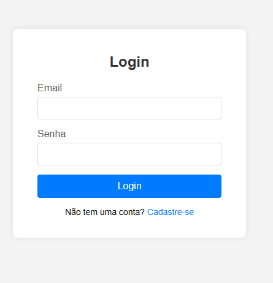

# Projeto Tela de Login com Supabase

Este README fornece uma visão geral do projeto, suas funcionalidades e informações importantes sobre a autenticação.

## Funcionalidades

## Autenticação com Supabase

O sistema utiliza o Supabase para autenticação de usuários.

### Autenticação de Dois Fatores (2FA)

Para facilitar os testes e o processo de login inicial durante o desenvolvimento, a autenticação de dois fatores (2FA) foi desabilitada. Esta é uma configuração que pode ser gerenciada diretamente nas configurações do seu projeto Supabase. Recomenda-se habilitar o 2FA em um ambiente de produção para maior segurança.

### Tabela de Usuários

Não é necessário criar uma tabela específica para armazenar informações de usuários. O Supabase já fornece uma tabela `auth.users` pronta para uso, que gerencia automaticamente os dados dos usuários registrados.

## Telas da Aplicação

Abaixo estão as telas de cadastro e login da aplicação:

### Tela de Cadastro

### Tela de Login

 
